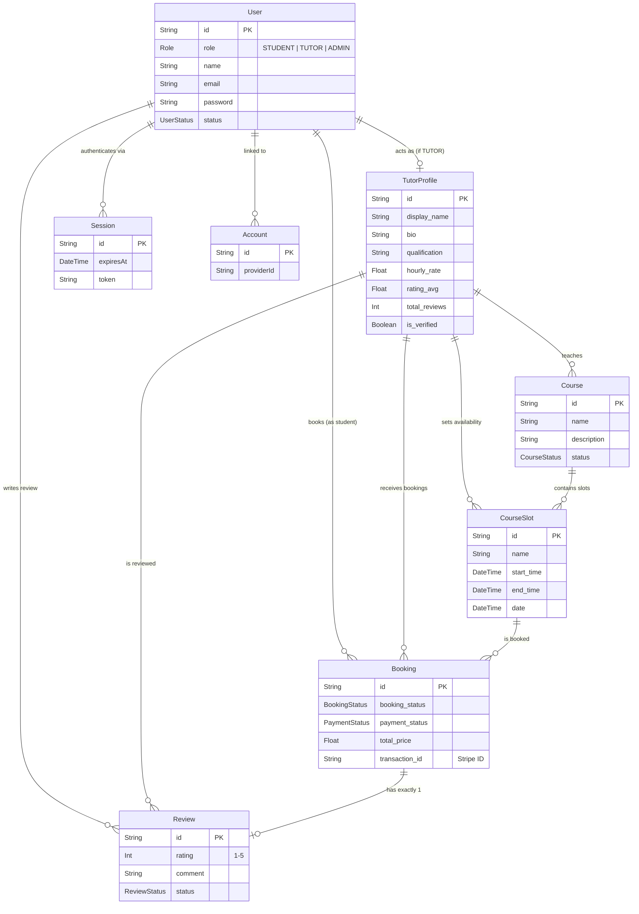

# SkillBridge Database ER Diagram

Here is a visual map of the database schema generated via Mermaid. It maps out your core `User` model integrating seamlessly with Better Auth, connecting through the complex `TutorProfile` into `Courses`, `CourseSlots`, `Bookings`, and `Reviews`.

> [!TIP]
> **Understanding the Arrows:**
> - `||--o{` means **One-to-Many** (e.g., One User has Many Bookings)
> - `||--o|` means **One-to-One** (e.g., One User has exactly One Tutor Profile, One Booking has exactly One Review)
